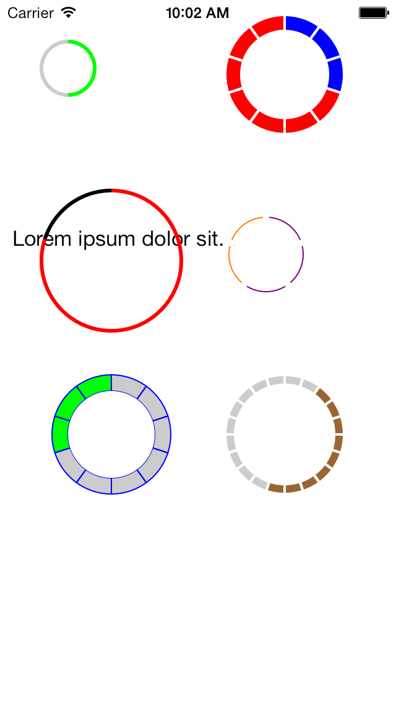

# MDRadialProgress

A custom UIView useful to represent progress in discrete steps. 

It has the following features:

* Draw progress in separated slices or as a single arc.
* Can customize all colors, the distance of the slices and their thickness. 
* Clockwise and anti-clockwise drawing order.
* Can start progress from any slice, not necessarily from the top.
* Display a label with the current progress. The label size automatically adapts to the space available.
* Themes support for easier customization of multiple views.
* Fully accessible
* Support iOS 6.0+
* Original BSD and Commercial Non-Attribution licenses available (you can use it in commercial software).



## Documentation

### Installation

Either use CocoaPods by adding the line below to your _Podfile_:

```
pod MDRadialProgress
```

or copy `MDRadialProgress.{h|m}`, `MDRadialProgressLabel.{h|m}`, `MDRadialProgressTheme.{h|m}` into your project.

### Usage

There is an extensive example included in `ViewController.m`. Tweak it and run it to experiment. 

Version 1.0 has introduced the concept of *theme* in order to make the customisation of many progress views
simpler. If for example you have a table where in every cell you have a MDRadialProgressView, now you
can create a theme with the appearance you like and apply it to all views, instead of customising
each view singularly.

## Localization
The component is fully accessible and it uses two labels that can be used by
VoiceOver to speak the current progress value to the user. 
If you want to provide localized text messages translate these two labels in your Localization.strings files:

"Progress"
"Progress changed to:"

## License
From version 1.0, the software changed license from MIT to the original BSD.

The original BSD allows you to use and redistribute the software in both Open Source
and commercial applications, **but it requires attribution**. 
Your software must contain, either in the software itself or on the product page and in
any advertising material the sentence:

```
This product includes the MDRadialProgress software component developed by Marco Dinacci.
```

I'm aware that some people need a license agreement which does not require attribution. If you’re in that situation, you can easily purchase a non-attribution license from my [online license store](http://sites.fastspring.com/intransitione/product/mdradialprogresslicenses).

If the original BSD license doesn't cut it for you please let me know by writing an e-mail at
hello AT infinityrealm.com. I'll be happy to help.

Note that all versions before 1.0 are still licensed under the MIT license.

## Contributors
See the [Contributors page](https://github.com/mdinacci/MDRadialProgress/graphs/contributors) on github.

[](https://bitdeli.com/free "Bitdeli Badge")

